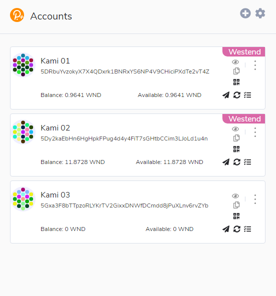
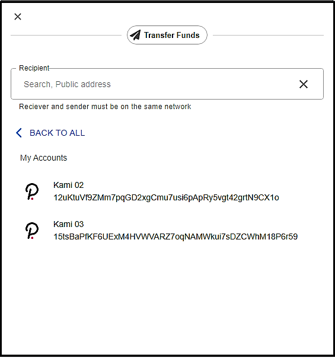
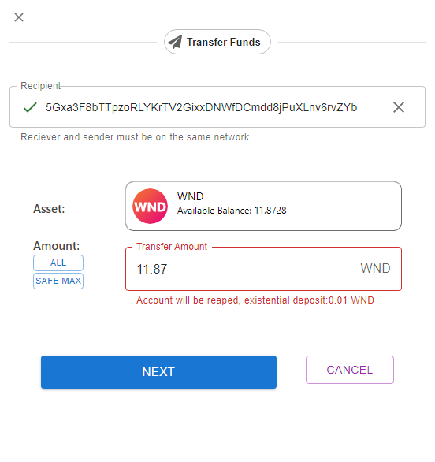
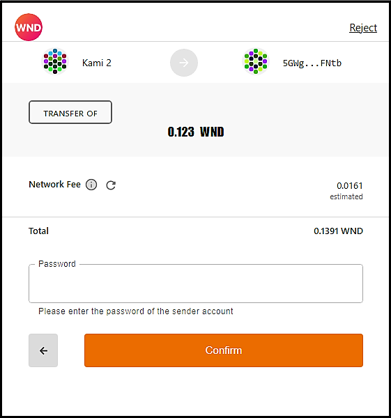
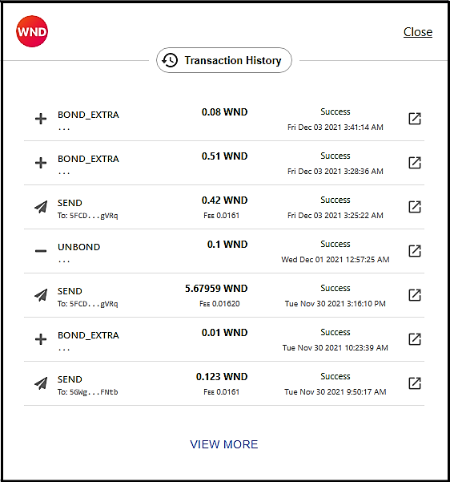

# 

A user-friendly wallet to interact with the Polkadot/substrate blockchain through a browser. It allows users to access their Polkadot account(s), which can also be used to interact with decentralized apps.

It is based on polkadot js extension, which injects a [@polkadot/api](https://github.com/polkadot-js/api) Signer into a page, along with any associated accounts.

## Installation (Development version)

Steps to build the extension and view your changes in a browser:

1. Build via `yarn build` or `yarn watch`
2. Install the extension
  - Chrome:
    - go to `chrome://extensions/`
    - ensure you have the Development flag set
    - "Load unpacked" and point to `packages/extension/build`
    - if developing, after making changes - refresh the extension
  - Firefox:
    - go to `about:debugging#addons`
    - check "Enable add-on debugging"
    - click on "Load Temporary Add-on" and point to `packages/extension/build/manifest.json`
    - if developing, after making changes - reload the extension

Once added, you can create an account (via a generated seed) or import via an existing seed.

## How Tos

Accounts page, shows the list of all accounts an their balances which you have created/imported on polkadot/kusama blockchain and parachains.

You can transfer funds with the extention, first add a recepient, you can choose recepient from you accounts list to transfer between your accounts:

Choose amount you want to transfer, extension shows appropriate alerts based on your selected amount. you can click on Safe Max to withdraw all from your account while still keep your account active.

In transaction confirmation page, you can confirm the transaction to be send to the blockchain by entering your sending account password.

After a little while, depend on the network response time, transaction will be done and you see the following page and your balance(s) will be updated.

you can see the transaction histroy from the account page like the following, which shows the transaction details, status, if failed, fail reason, and a link to subscan for more info.

...