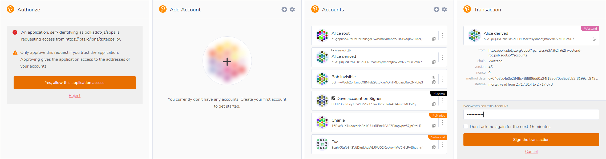

[](https://polkadot.js.org)

[](https://www.npmjs.com/package/@polkadot/extension)
[](https://www.npmjs.com/package/@polkadot/extension)
[](https://codeclimate.com/github/polkadot-js/extension)

# 

A very simple scaffolding browser extension that injects a [@polkadot/api](https://github.com/polkadot-js/api) Signer into a page, along with any associated accounts, allowing for use by any dapp. This is an extensible POC implementation of a Polkadot/Substrate browser signer.

As it stands, it does one thing: it _only_ manages accounts and allows the signing of transactions with those accounts. It does not inject providers for use by dapps at this early point, nor does it perform wallet functions where it constructs and submits txs to the network.

## Installation

- On Chrome, install via [Chrome web store](https://chrome.google.com/webstore/detail/polkadot%7Bjs%7D-extension/mopnmbcafieddcagagdcbnhejhlodfdd)
- On Firefox, install via [Firefox add-ons](https://addons.mozilla.org/en-US/firefox/addon/polkadot-js-extension/)



## Documentation and examples
Find out more about how to use the extension as a Dapp developper, cookbook, as well as answers to most frequent questions in the [Polkadot-js extension documentation](https://polkadot.js.org/docs/extension/)

## Development version

Steps to build the extension and view your changes in a browser:

1. Build via `yarn build` or `yarn watch`
2. Install the extension
  - Chrome:
    - go to `chrome://extensions/`
    - ensure you have the Development flag set
    - "Load unpacked" and point to `packages/extension/build`
    - if developing, after making changes - refresh the extension
  - Firefox:
    - go to `about:debugging#addons`
    - check "Enable add-on debugging"
    - click on "Load Temporary Add-on" and point to `packages/extension/build/manifest.json`
    - if developing, after making changes - reload the extension
3. When visiting `https://polkadot.js.org/apps/` it will inject the extension

Once added, you can create an account (via a generated seed) or import via an existing seed. The [apps UI](https://github.com/polkadot-js/apps/), when loaded, will show these accounts as `<account name> (extension)`

## Development

The repo is split into a number of packages -

- [extension](packages/extension/) - All the injection and background processing logic (the main entry)
- [extension-ui](packages/extension-ui/) - The UI components for the extension, to build up the popup
- [extension-dapp](packages/extension-dapp/) - A convenience wrapper to work with the injected objects, simplifying data extraction for any dapp that wishes to integrate the extension (or any extension that supports the interface)
- [extension-inject](packages/extension-inject/) - A convenience wrapper that allows extension developers to inject their extension for use by any dapp

## Dapp developers

The actual in-depth technical breakdown is given in the next section for any dapp developer wishing to work with the raw objects injected into the window. However, convenience wrappers are provided that allows for any dapp to use this extension (or any other extension that conforms to the interface) without having to manage any additional info.

The documentation for Dapp development is available [in the polkadot-js doc](https://polkadot.js.org/docs/extension).

This approach is used to support multiple external signers in for instance [apps](https://github.com/polkadot-js/apps/). You can read more about the convenience wrapper [@polkadot/extension-dapp](packages/extension-dapp/) along with usage samples.

## API interface

The extension injection interfaces are generic, i.e. it is designed to allow any extension developer to easily inject extensions (that conforms to a specific interface) and at the same time, it allows for any dapp developer to easily enable the interfaces from multiple extensions at the same time. It is not an all-or-nothing approach, but rather it is an ecosystem where the user can choose which extensions fit their style best.

From a dapp developer perspective, the only work needed is to include the [@polkadot/extension-dapp](packages/extension-dapp/) package and call the appropriate enabling function to retrieve all the extensions and their associated interfaces.

From an extension developer perspective, the only work required is to enable the extension via the razor-thin [@polkadot/extension-inject](packages/extension-inject/) wrapper. Any dapp using the above interfaces will have access to the extension via this interface.

When there is more than one extension, each will populate an entry via the injection interface and each will be made available to the dapp. The `Injected` interface, as returned via `enable`, contains the following information for any compliant extension -

```js
interface Injected {
  // the interface for Accounts, as detailed below
  readonly accounts: Accounts;
  // the standard Signer interface for the API, as detailed below
  readonly signer: Signer;
  // not injected as of yet, subscribable provider for polkadot-js API injection,
  // this can be passed to the API itself upon construction in the dapp
  // readonly provider?: Provider
}

interface Account = {
  // ss-58 encoded address
  readonly address: string;
  // the genesisHash for this account (empty if applicable to all)
  readonly genesisHash?: string;
  // (optional) name for display
  readonly name?: string;
};

// exposes accounts
interface Accounts {
  // retrieves the list of accounts for right now
  get: () => Promise<Account[]>;
  // (optional) subscribe to all accounts, updating as they change
  subscribe?: (cb: (accounts: Account[]) => any) => () => void
}

// a signer that communicates with the extension via sendMessage
interface Signer extends SignerInterface {
  // no specific signer extensions, exposes the `sign` interface for use by
  // the polkadot-js API, confirming the Signer interface for this API
}
```

## Injection information

The information contained in this section may change and evolve. It is therefore recommended that all access is done via the [@polkadot/extension-dapp](packages/extension-dapp/) (for dapps) and [extension-inject](packages/extension-inject/) (for extensions) packages, which removes the need to work with the lower-level targets.

The extension injects `injectedWeb3` into the global `window` object, exposing the following: (This is meant to be generic across extensions, allowing any dapp to utilize multiple signers, and pull accounts from multiples, as they are available.)

```js
window.injectedWeb3 = {
  // this is the name for this extension, there could be multiples injected,
  // each with their own keys, here `polkadot-js` is for this extension
  'polkadot-js': {
    // semver for the package
    version: '0.1.0',

    // this is called to enable the injection, and returns an injected
    // object containing the accounts, signer and provider interfaces
    // (or it will reject if not authorized)
    enable (originName: string): Promise<Injected>
  }
}
```

## Mnemonics, Passwords, and Imports/Exports

### Using the mnemonic and password from the extension

When you create a keypair via the extension, it supplies a 12-word mnemonic seed and asks you to create a password. This password only encrypts the private key on disk so that the password is required to spend funds in `polkadot-js/apps` or to import the account from backup. The password does not protect the mnemonic phrase. That is, if an attacker were to acquire the mnemonic phrase, they would be able to use it to spend funds without the password.

### Importing mnemonics from other key generation utilities

Some key-generation tools, e.g. [Subkey](https://www.substrate.io/kb/integrate/subkey), support hard and soft key derivation as well as passwords that encrypt the mnemonic phrase such that the mnemonic phrase itself is insufficient to spend funds.

The extension supports these advanced features. When you import an account from a seed, you can add these derivation paths or password to the end of the mnemonic in the following format:

```
<mnemonic phrase>//<hard>/<soft>///<password>
```

That is, hard-derivation paths are prefixed with `//`, soft paths with `/`, and the password with `///`.

The extension will still ask you to enter a password for this account. As before, this password only encrypts the private key on disk. It is not required to be the same password as the one that encrypts the mnemonic phrase.

Accounts can also be derived from existing accounts – `Derive New Account` option in account's dropdown menu should be selected. After providing the password of the parent account, along with name and password of the derived account, enter derivation path in the following format:

```
//<hard>/<soft>
```

The path will be added to the mnemonic phrase of the parent account.
